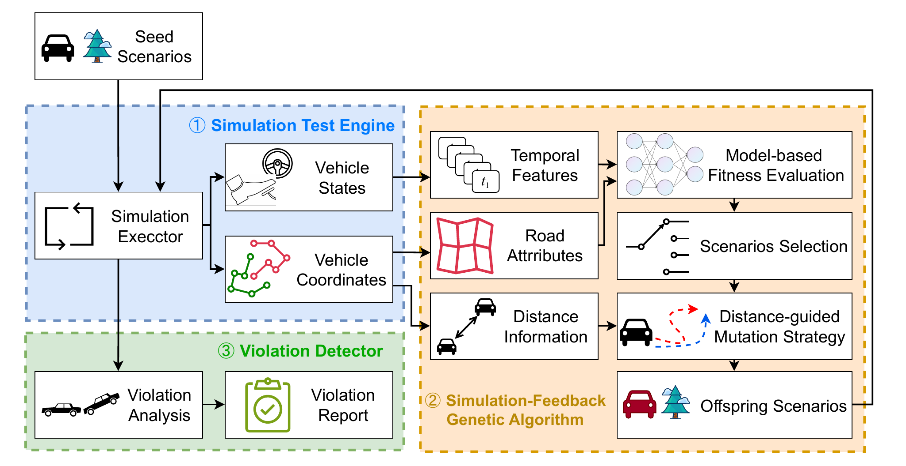
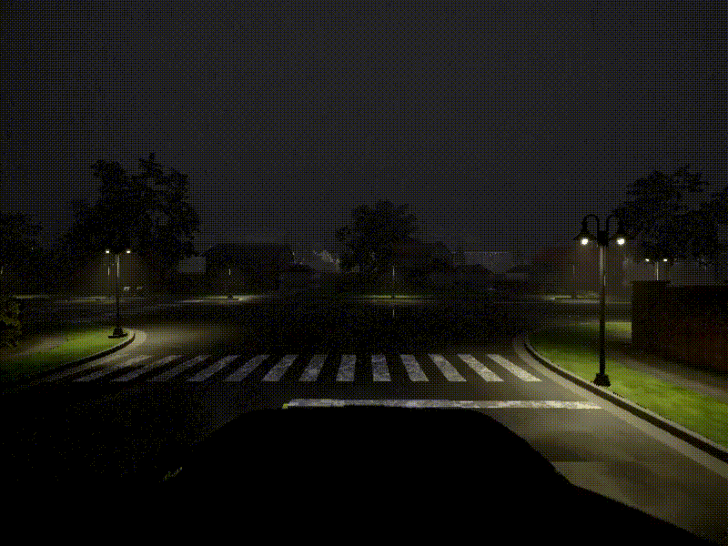

# SimADFuzz

SimADFuzz: Simulation-Feedback Fuzz Testing for Autonomous Driving Systems



> The DOI for this repository is: 10.6084/m9.figshare.28769768

## Introduction

SimADFuzz is a fuzz testing method for autonomous driving systems that generates diverse driving scenarios to detect
potential violations in the ADS. It has the following characteristics and advantages:

1. SimADFuzz embeds driving scenarios into a high-dimensional feature space based on temporal models, which predicts the
   probability of scenario violations and is used to optimize the scenario selection strategy.
2. SimADFuzz collects feedback during the simulation process to optimize scenario crossover and mutation strategies.
   This increases the number of interactions between the Ego vehicle and other traffic participants, triggering more
   edge cases in the ADS, thereby enhancing the likelihood of detecting violations.



## Setup and Usage of SimADFuzz

### System Environment

The system environment to set up SimADFuzz is as follows:

| Component | Specification           |
|-----------|-------------------------|
| CPU       | Intel i9-14900K         |
| GPU       | NVIDIA GeForce RTX 3090 |
| RAM       | 64 GB                   |
| OS        | Ubuntu 20.04 LTS        |
| Python    | 3.7.16 and 3.10.5       |
| CARLA     | Version 0.9.13          |

### Installation and Configuration

1. Clone the repositories for SimADFuzz and our modified version
   of [SDC-Scissor](https://github.com/yagol2020/SDC-Scissor)

    ```shell
    git clone https://github.com/yagol2020/SimADFuzz.git SimADFuzz
    git clone https://github.com/yagol2020/SDC-Scissor sdc-scissor
    ```

2. Prepare the required environment for Python, Docker, and CARLA. We recommend using Anaconda to manage the Python
   environment.

    ```shell
    conda create -n simadfuzz python=3.7    # for SimADFuzz and InterFuser
    conda create -n sdc python=3.10.5    # for SDC-Scissor
    ```

   Then, install the Python requirements for `SimADFuzz` and `InterFuser`:

    ```shell
    conda activate simadfuzz
    pip install -r requirements.txt    # requirements of SimADFuzz
    cd InterFuser
    pip install -r requirements.txt    # requirements of InterFuser
    cd interfuser_code
    python setup.py develop    # install InterFuser
    ```

   Download model weights from InterFuser [repo](https://github.com/opendilab/InterFuser), move it into `team_code` dir.

   ```shell
   mv xxx.pth InterFuser/team_code/interfuser.pth.tar
   ```

   Download model weights and others require files from LMDrive [repo](https://github.com/opendilab/LMDrive), move them into `team_code` dir.

   ```shell
   mv llava-v1.5-7b LMDrive/team_code/llava-v1.5-7b
   mv llava-v1.5-checkpoint.pth LMDrive/team_code/llava-v1.5-checkpoint.pth
   mv vision-encoder-r50.pth.tar LMDrive/team_code/vision-encoder-r50.pth.tar
   ```

   SimADFuzz depends on the Docker version of the CARLA simulator. Before pulling the Docker image for CARLA v0.9.13,
   make sure that Docker is installed on your system.

    ```shell
    docker pull carlasim/carla:0.9.13    # pull carla v0.9.13
    ```

   Install the Python requirements for `SDC-Scissor`. For more documentation on `SDC-Scissor`, follow
   the [link](https://sdc-scissor.readthedocs.io/en/latest/user_documentation/quick_start.html).
   ```shell
   conda activate sdc
   cd sdc-scissor
   pip install poetry
   poetry install
   ```

3. Config fuzzer. Some parameters need to be configured before fuzz testing in fuzz.py:
   ```python
   if __name__ == "__main__":
      pop_size = 10    # the population number in GA
      npc_num = 2    # the NPC vehicles number generated in the scenarios
      walker_num = 10    # the pedestrians number generated in the scenarios
      town_str = "Town03"    # the map of CARLA
      res_path = "/path/to"    # the dir to save the results
   ```

### Start Fuzz Testing with SimADFuzz

After the installation and configuration of SimADFuzz, use the following commands to start fuzz testing.

First, start the SDC-Scissor service. The service will listen on port `12555` to receive the file path that contains the
vehicle trajectories.

> Make sure the `12555` port is not being used by any other program.

```shell
conda activate sdc
python sdc-scissor/sdc_service.py
```

Next, start fuzz testing:

```shell
python fuzz.py
```

### Violation Recorder

The scenarios generated by SimADFuzz and the violation recorder are saved in `res_path`. The dictionary `X:Y` includes
the results of `X` generations and `Y` scenarios. The structure of `X:Y` should be as follows:

```shell
.
├── ego.json
├── end_sim_time.json
├── info.csv
├── npcs.json
├── oracles
│   ├── front.mp4
│   ├── min_dis.json
│   ├── state.pick
│   └── top.mp4
├── recorder.rec
├── start_sim_time.json
├── town_str.json
├── trace.png
├── walkers.json
└── weather.json
```

The following table describes the content of each file:

| Name                 | Description                                                                 |
|----------------------|-----------------------------------------------------------------------------|
| ego.json             | The route of the ego vehicle                                                |
| npcs.json            | The routes of the NPC vehicles                                              |
| walkers.json         | The routes of the pedestrians                                               |
| weather.json         | The weather conditions in the simulation world                              |
| town_str.json        | The town name of the scenario                                               |
| start_sim_time.json  | The time when the scenario simulation starts                                |
| end_sim_time.json    | The time when the scenario simulation ends                                  |
| info.csv             | Feedback information, including coordinates and physical states of vehicles |
| recorder.rec         | The recorder file saved by the CARLA API                                    |
| trace.png            | The trajectory plot of each vehicle                                         |
| oracles/front.mp4    | The video captured by the front camera                                      |
| oracles/top.mp4      | The video captured by the top camera                                        |
| oracles/min_dis.json | The minimum distance between the ego vehicle and other vehicles             |
| state.pick           | The relevant information about the simulation                               |

### Replay by SimADFuzz

#### CARLA Recorder

The following command can be used to replay a recorder generated by the CARLA API, i.e., `recorder.rec`:

```shell
python replay.py --carla-recorder --carla-recorder-path paper_case_study/collision/1/recorder.rec
```

#### SimADFuzz Scenario Recorder

The following command can be used to replay a scenario generated by SimADFuzz, which contains more control information
about InterFuser:

```shell
python reply.py --simadfuzz-recorder --simadfuzz-recorder-dir paper_case_study/collision/1
```

## Case Study

We provide the recorder to reproduce the night scenarios mentioned in our paper.

| Violation Type | Scenario Description                                                                                   | Recorder                            | Video                                                                                                                                                                                     |
|----------------|--------------------------------------------------------------------------------------------------------|-------------------------------------|-------------------------------------------------------------------------------------------------------------------------------------------------------------------------------------------|
| Collision      | Ego vehicle failed to respond appropriately to a pedestrian jaywalking, resulting in a side collision. | `paper_case_study/collision/1/`     |  [Front-view](paper_case_study/collision/1/oracles/front.mp4); [Top-view](paper_case_study/collision/1/oracles/top.mp4)             |
| Collision      | Ego vehicle collides with another vehicle while changing lanes to exit a crossroads.                   | `paper_case_study/collision/2/`     |  [Front-view](paper_case_study/collision/2/oracles/front.mp4); [Top-view](paper_case_study/collision/2/oracles/top.mp4)             |
| Collision      | Ego vehicle collides with another vehicle while changing lanes at an intersection.                     | `paper_case_study/collision/3/`     |  [Front-view](paper_case_study/collision/3/oracles/front.mp4); [Top-view](paper_case_study/collision/3/oracles/top.mp4)             |
| Collision      | Ego vehicle collides with another vehicle due to insufficient steering while turning right.            | `paper_case_study/collision/4/`     |  [Front-view](paper_case_study/collision/4/oracles/front.mp4); [Top-view](paper_case_study/collision/4/oracles/top.mp4)             |
| Collision      | Ego vehicle collides with roadside signboard due to misjudged lane markings.            | `paper_case_study/collision/5/`     |  [Front-view](paper_case_study/collision/5/fuzzerdata/output.mp4); [Top-view](paper_case_study/collision/5/oracles/top.mp4)             |
| Lane Invasion  | Ego vehicle illegally crosses the solid line while passing through an intersection.                    | `paper_case_study/lane_invasion/6/` |  [Front-view](paper_case_study/lane_invasion/5/oracles/front.mp4); [Top-view](paper_case_study/lane_invasion/5/oracles/top.mp4) |
| Lane Invasion  | Ego vehicle illegally crosses the solid line while turning right.                                      | `paper_case_study/lane_invasion/7/` |  [Front-view](paper_case_study/lane_invasion/6/oracles/front.mp4); [Top-view](paper_case_study/lane_invasion/6/oracles/top.mp4) |
| Stuck          | Ego vehicle failed to change lanes when the pedestrian in front remained stationary for too long.      | `paper_case_study/stuck/8/`         |  [Front-view](paper_case_study/stuck/7/oracles/front.mp4); [Top-view](paper_case_study/stuck/7/oracles/top.mp4)                         |
| Stuck          | Ego vehicle misjudged the state of the traffic lights, resulting in being stuck on a downhill ramp.    | `paper_case_study/stuck/9/`         |  [Front-view](paper_case_study/stuck/8/oracles/front.mp4); [Top-view](paper_case_study/stuck/8/oracles/top.mp4)                         |

## Acknowledgment

* InterFuser, [repo](https://github.com/opendilab/InterFuser)
* LMDrive, [repo](https://github.com/opendilab/LMDrive)
* AV-Fuzzer, [repo](https://github.com/cclinus/AV-Fuzzer)
* DriveFuzz, [repo](https://gitlab.com/s3lab-code/public/drivefuzz)
* TM-Fuzzer, [repo](https://github.com/ldegao/TMfuzz)
* CARLA, [repo](https://github.com/carla-simulator/carla)
* CARLA Leaderboard, [website](https://leaderboard.carla.org/leaderboard/)

